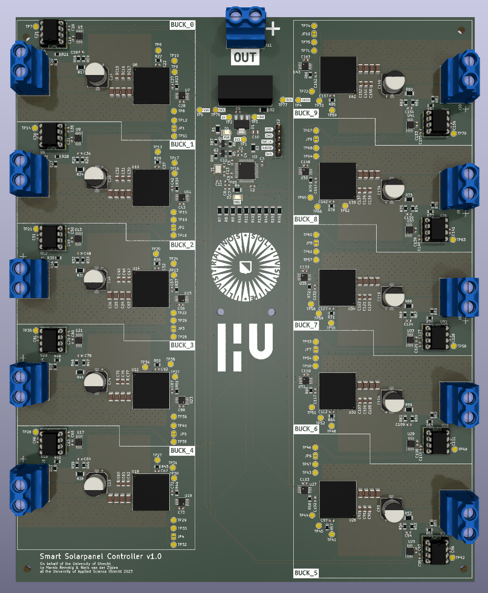
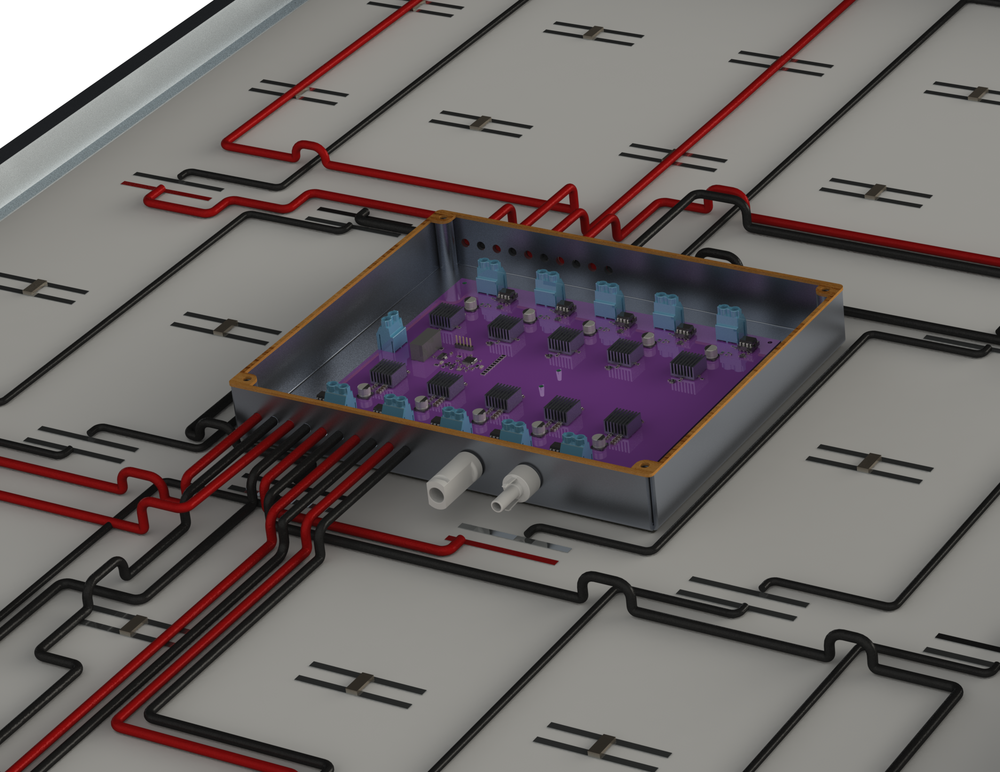

# Smart Solarpanel Controller

This project contains the files for a device and housing that enables a solarpanel to control the MPPT of ten different sections of the same solarpanel to improve efficiency in partially-shaded conditions. This device is a self-contained version of a prototype S. Zahra Mirbagheri Golroodbari created for their PhD [dissertation](https://www.mdpi.com/1996-1073/11/1/250) on creating a better and more efficient solarpanel, in which she has succeded. 

On behalf of the Univerity of Utrecht, created at the Univeristy of Applied Sciences Utrecht.

## Electronics

### PCB

The PCB is designed in Kicad. It's rated to handle atleast 10A of current with an MPP output of 29,41V (221.75W).

To find the MPPT for each of the ten sections a dedicated LTM4611EV Buck-converter with INA226 and supporting components are used. They are controlled by a central STM32F103C8T6 microcontroller.

Programming the microcontroller is done through SWD via the provided 2.54mm pitch pins besides it.

### Firmware

The code for the microcontroller has at this moment not been written yet. The pinout and external crystal were determined by using CubeIDE as a tool to assist in layout, which can be used further to develop the firmware for the device.

## Mechanicals

The mechanical enclosure was calculated using Solidworks Simulation software to make sure it does not exceed the maximum allowed temperature of 70 degrees Celsius. For this reason the enclosure is made out of aluminium.

### Connections

The electrical connections are made using copper wire, as it is cheap and the resistance is low. Since a lot more of the cells are wired in parallel than in a conventional panel, thicker wire must be used to keep the losses under 2%. The wires are routed to the central PCB, where the MPP is calculated and everything is controlled.

The enclosure is waterproof with an IP65 rating. It is glued to the back of the panel. Several panels can be connected in series using standard connectors.

## Use

The provided files can be used as template to retrofit a classic solarpanel into a smart solarpanel. The PCB can be ordered and assembled, after which it can be fitted to the solar panel in the custom housing. 

## Built With

* [Kicad](https://www.kicad.org/) - EDA
* [STM32CubeIDE](https://www.st.com/en/development-tools/stm32cubeide.html) - IDE 
* [SolidWorks](https://www.solidworks.com/) - CAD

## Authors

* **Niels van der Zijden** - [Yopocho](https://github.com/yopocho)
* **Marnix Remmig** 
* **Teun Drijfhout** 
* **Silas Witmond** 

## License

This project is licensed under the MIT License

## Acknowledgments

* **Dr. Sara Mirbagheri Golroodbari** - Commisioner
* **Joost Kouijzer** - Group supervisor during this project
* **Marcel** - For letting our group use his lab during the project

